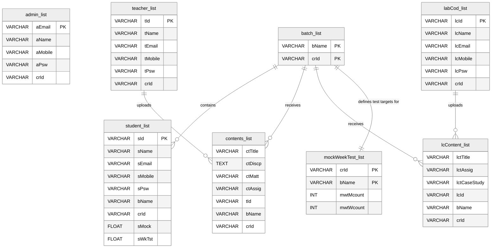
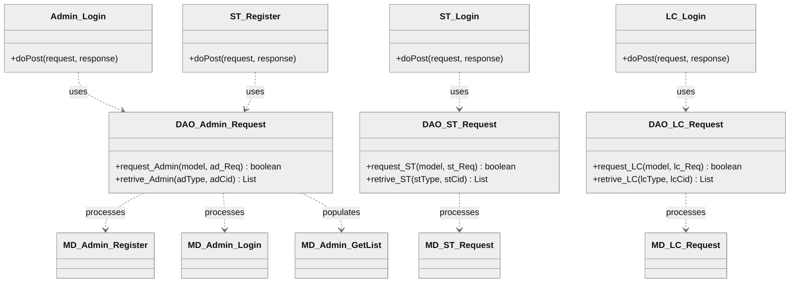
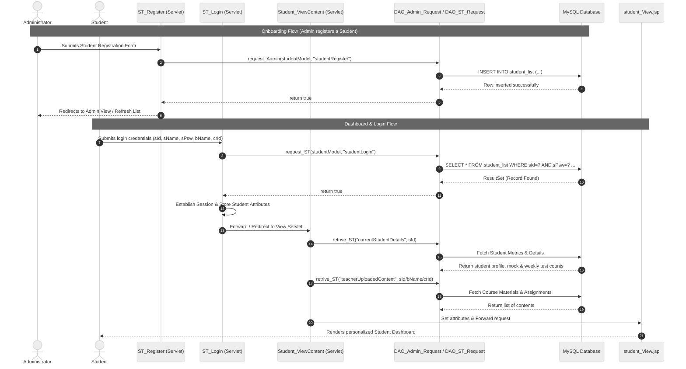

# LMS Portal (Learning Management System)

A comprehensive, role-based Learning Management System (LMS) designed to facilitate seamless collaboration and progress tracking between **Administrators**, **Teachers**, **Lab Coordinators**, and **Students**. Built as a robust Java Full-Stack web application, it leverages Java Servlets, JSP (JavaServer Pages), JDBC (Java Database Connectivity), and a MySQL database backend.

---

## 📌 Project Overview & Architecture

The LMS Portal is designed around four key user roles, each having a dedicated workspace and customized permissions. The application follows the **MVC (Model-View-Controller)** design pattern:
*   **Model**: Java bean classes representing the data entities (e.g., `MD_Admin_Register`, `MD_ST_Request`, `MD_LC_Request`).
*   **View**: Responsive HTML pages and dynamic JSP views (e.g., `admin_View.jsp`, `student_View.jsp`, `teacher_View.jsp`).
*   **Controller**: Java Servlets mapping client requests, interacting with the DAO layer, and routing to the appropriate views (e.g., `Admin_Login`, `ST_Register`, `LC_ConUpload`).
*   **Data Access Object (DAO)**: Dedicated database interaction classes using JDBC to execute SQL queries on a MySQL server (e.g., `DAO_Admin_Request`, `DAO_ST_Request`, `DAO_LC_Request`).

---

## 📊 UML & Architecture Diagrams

### 1. Use Case Diagram
This diagram outlines the interactions of the four distinct user roles with the LMS Portal system.

```mermaid
%%{init: {'theme': 'neutral'}}%%
flowchart LR
    %% Actors
    Admin((Administrator))
    Teacher((Teacher))
    LC((Lab Coordinator))
    Student((Student))

    %% Admin Use Cases
    subgraph Admin_Use_Cases [Admin Functions]
        A1(Admin Login / Register)
        A2(Onboard & Manage Teachers)
        A3(Onboard & Manage Students)
        A4(Onboard & Manage Lab Coordinators)
        A5(Create & Manage Batches)
        A6(Set Mock & Weekly Test Targets)
        A7(Update & Delete User Profiles)
    end

    %% Teacher Use Cases
    subgraph Teacher_Use_Cases [Teacher Functions]
        T1(Teacher Login)
        T2(Update Own Profile)
        T3(Upload Class Materials & Assignments)
        T4(Delete Uploaded Class Content)
        T5(View Batch Students & Progress)
    end

    %% Lab Coordinator Use Cases
    subgraph LC_Use_Cases [Lab Coordinator Functions]
        L1(Lab Coordinator Login / Register)
        L2(Upload Lab Sheets & Case Studies)
        L3(Delete Uploaded Lab Content)
        L4(View Student List & Performance)
    end

    %% Student Use Cases
    subgraph Student_Use_Cases [Student Functions]
        S1(Student Login)
        S2(Update Personal Profile)
        S3(Access Course Materials & Theory Assignments)
        S4(Access Lab Sheets & Case Studies)
        S5(Track Personal Test Counts & Progress Metrics)
    end

    %% Links
    Admin --> A1
    Admin --> A2
    Admin --> A3
    Admin --> A4
    Admin --> A5
    Admin --> A6
    Admin --> A7

    Teacher --> T1
    Teacher --> T2
    Teacher --> T3
    Teacher --> T4
    Teacher --> T5

    LC --> L1
    LC --> L2
    LC --> L3
    LC --> L4

    Student --> S1
    Student --> S2
    Student --> S3
    Student --> S4
    Student --> S5
```



---

### 2. Entity-Relationship (ER) Diagram
The database schema consists of 8 tables managed under the `lms` database in MySQL.



---

### 3. Class Diagram
Representing the relationship between Controllers, Data Access Objects (DAOs), and Data Models within the codebase.



---

### 4. Sequence Diagram: Student Registration & Dashboard Loading
This sequence diagram visualizes the flow of data when an Administrator registers a student, followed by the student logging in to view their dashboard.



---

## 🛠️ Database Setup (SQL Schema)

Before running the application, set up the MySQL database schemas. Open your MySQL Command Line Client or MySQL Workbench and execute the following SQL script to create the database, tables, and seed initial columns:

```sql
-- Create the LMS database
CREATE DATABASE IF NOT EXISTS lms;
USE lms;

-- 1. Table for Administrator registrations
CREATE TABLE IF NOT EXISTS admin_list (
    aName VARCHAR(100) NOT NULL,
    aEmail VARCHAR(100) NOT NULL,
    aMobile VARCHAR(20),
    aPsw VARCHAR(50) NOT NULL,
    crId VARCHAR(50) NOT NULL,
    PRIMARY KEY (aEmail)
);

-- 2. Table for Teachers / Course Instructors
CREATE TABLE IF NOT EXISTS teacher_list (
    tId VARCHAR(50) NOT NULL,
    tName VARCHAR(100) NOT NULL,
    tEmail VARCHAR(100) NOT NULL,
    tMobile VARCHAR(20),
    tPsw VARCHAR(50) NOT NULL,
    crId VARCHAR(50) NOT NULL,
    PRIMARY KEY (tId)
);

-- 3. Table for Students
CREATE TABLE IF NOT EXISTS student_list (
    sId VARCHAR(50) NOT NULL,
    sName VARCHAR(100) NOT NULL,
    sEmail VARCHAR(100) NOT NULL,
    sMobile VARCHAR(20),
    sPsw VARCHAR(50) NOT NULL,
    bName VARCHAR(50) NOT NULL,
    crId VARCHAR(50) NOT NULL,
    sMock FLOAT DEFAULT 0,
    sWkTst FLOAT DEFAULT 0,
    PRIMARY KEY (sId)
);

-- 4. Table for Lab Coordinators
CREATE TABLE IF NOT EXISTS labCod_list (
    lcId VARCHAR(50) NOT NULL,
    lcName VARCHAR(100) NOT NULL,
    lcEmail VARCHAR(100) NOT NULL,
    lcMobile VARCHAR(20),
    lcPsw VARCHAR(50) NOT NULL,
    crId VARCHAR(50) NOT NULL,
    PRIMARY KEY (lcId)
);

-- 5. Table for Course Batches
CREATE TABLE IF NOT EXISTS batch_list (
    bName VARCHAR(50) NOT NULL,
    crId VARCHAR(50) NOT NULL,
    PRIMARY KEY (bName, crId)
);

-- 6. Table for target Mock and Weekly test counts per batch
CREATE TABLE IF NOT EXISTS mockWeekTest_list (
    mwtMcount INT DEFAULT 0,
    mwtWcount INT DEFAULT 0,
    crId VARCHAR(50) NOT NULL,
    bName VARCHAR(50) NOT NULL,
    PRIMARY KEY (crId, bName)
);

-- 7. Table for Course Content uploaded by Teachers (Theory)
CREATE TABLE IF NOT EXISTS contents_list (
    ctTitle VARCHAR(200) NOT NULL,
    ctDiscp TEXT,
    ctMatt VARCHAR(500), -- Path or link to course material
    ctAssig VARCHAR(500), -- Path or link to assignments
    tId VARCHAR(50) NOT NULL,
    bName VARCHAR(50) NOT NULL,
    crId VARCHAR(50) NOT NULL
);

-- 8. Table for Lab Content uploaded by Lab Coordinators (Practical)
CREATE TABLE IF NOT EXISTS lcContent_list (
    lctTitle VARCHAR(200) NOT NULL,
    lctAssig VARCHAR(500), -- Lab exercises/assignments
    lctCaseStudy VARCHAR(500), -- Case studies
    lcId VARCHAR(50) NOT NULL,
    bName VARCHAR(50) NOT NULL,
    crId VARCHAR(50) NOT NULL
);
```

---

## ⚙️ Installation & Configuration Steps

Follow these steps to set up the project on your local machine:

### Prerequisites
Make sure you have the following installed on your operating system (Windows):
1.  **Java Development Kit (JDK 21)**: Ensure `JAVA_HOME` is set up in your system environment variables.
2.  **MySQL Server**: Running locally on port `3306`.
3.  **Apache Tomcat 10.x or higher**: Essential since the project uses the newer `jakarta.servlet` API (Jakarta EE 10 specification) rather than the deprecated `javax.servlet` API.
4.  **Eclipse IDE for Enterprise Java and Web Developers**: Standard IDE for dynamic web projects.

### Step 1: Database Credentials Configuration
By default, the database connection parameters in the DAOs (`DAO_Admin_Request.java`, `DAO_ST_Request.java`, and `DAO_LC_Request.java`) are configured as:
*   **JDBC URL**: `jdbc:mysql://localhost:3306/lms`
*   **User**: `root`
*   **Password**: `Shakeer@123`

If your local MySQL credentials differ, search the files for these fields and update them accordingly:
```java
private static final String JDBC_URL = "jdbc:mysql://localhost:3306/lms";
private static final String JDBC_USER = "your_mysql_username";
private static final String JDBC_PASSWORD = "your_mysql_password";
```

### Step 2: Import Project into Eclipse
1.  Open **Eclipse IDE**.
2.  Go to `File` -> `Import...` -> `General` -> `Existing Projects into Workspace`.
3.  Select the **Root Directory** as the path to this `LMS-Protal` folder.
4.  Click **Finish**.

### Step 3: Add Dependencies / Configure Build Path
Since this is an Eclipse dynamic web project without a Maven pom, dependencies are configured directly in the classpath:
1.  Right-click on the `LMS-Protal` project in the Project Explorer.
2.  Select `Build Path` -> `Configure Build Path...`.
3.  Under the `Libraries` tab, ensure the following are present:
    *   **JRE System Library** (JavaSE-21 or compatible).
    *   **jakarta.servlet-api-6.1.0.jar** (For Servlet compilation).
    *   **mysql-connector-j-9.1.0.jar** (For MySQL database communication).
4.  If they are missing, click **Add External JARs...** and navigate to your local directory containing these files to add them.
5.  Ensure that `mysql-connector-j-9.1.0.jar` is also placed inside the project's `src/main/webapp/WEB-INF/lib` folder so that Tomcat can package it inside the deployment archive.

---

## 🚀 Running the Application

### Step 1: Set up Apache Tomcat in Eclipse
1.  In Eclipse, go to the **Servers** tab (usually at the bottom). If not visible, open it via `Window` -> `Show View` -> `Servers`.
2.  Right-click in the tab and select `New` -> `Server`.
3.  Select **Apache** -> **Tomcat v10.1 Server** (or your installed Tomcat 10+ version).
4.  Provide the path to your Tomcat installation directory and click **Finish**.

### Step 2: Deploy and Start the Server
1.  Right-click on the newly added Tomcat Server.
2.  Select **Add and Remove...**.
3.  Select **LMS-Protal** from the Available list, click **Add >** to move it to the Configured list, then click **Finish**.
4.  Right-click on the Server again and click **Start** (or click the green Play icon).
5.  Wait for the console logs to display `Server startup in [X] milliseconds` without errors.

### Step 3: Launch the Portal
1.  Open your web browser.
2.  Navigate to the local deployment URL:
    ```
    http://localhost:8080/LMS-Protal/
    ```
    *(Note: If you configured your Tomcat port differently, replace `8080` with your customized port).*
3.  The browser will load `index.html` which serves as the landing portal redirecting to the respective login dashboards.

